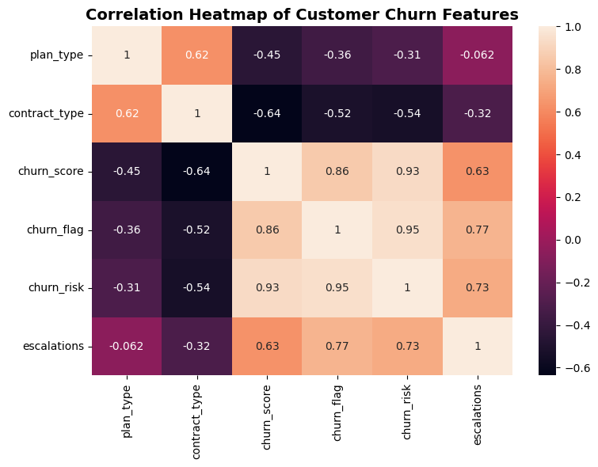
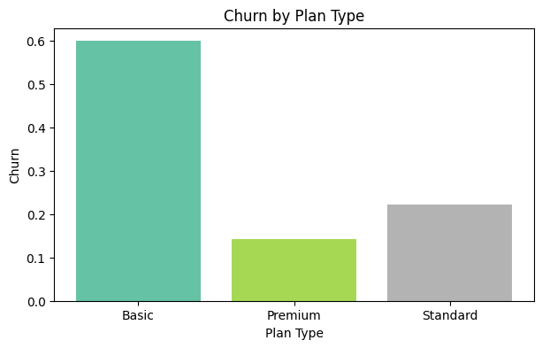
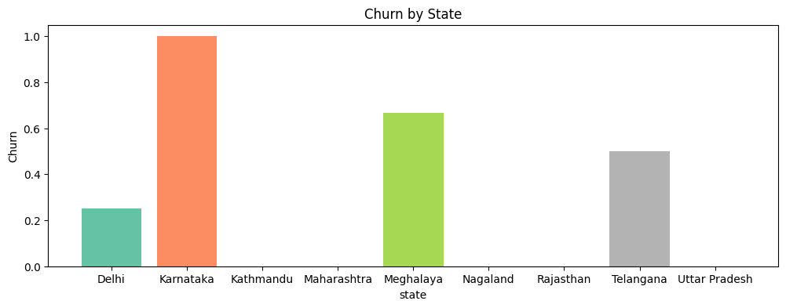
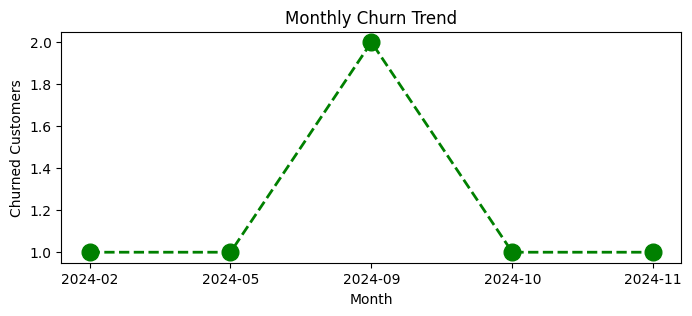

# 📊 Customer Churn Analysis

## Project Overview

This project analyzes customer churn data to identify the factors influencing customer retention. The project includes data cleaning, exploratory data analysis (EDA), SQL queries, and data visualization using Python.

---

## Tools & Technologies

- Python
- Pandas
- NumPy
- Matplotlib
- Seaborn
- SQLite
- Jupyter Notebook

---

## Dataset

The dataset was cleaned from a SQLite database and exported as a CSV file before analysis.

---

## Project Workflow

- Data Cleaning
- Exploratory Data Analysis (EDA)
- SQL Queries
- Feature Encoding
- Correlation Analysis
- Data Visualization

---

## Visualizations

### Correlation Heatmap

### Churn by Plan Type

### Churn by State

### Monthly Churn Trend

---

## Key Insights

- Customers subscribed to the Basic plan experienced a higher churn rate than those on Premium and Standard plans.
- Contract type is strongly associated with customer churn, indicating that contract duration influences customer retention.
- The correlation analysis highlights important relationships between churn score, churn flag, and churn risk.
- Customer churn varies across different states, indicating possible regional differences.
- Monthly churn trends reveal fluctuations that may help identify periods of higher customer attrition.

## Project Files

- `customer_churn_analysis.ipynb` – Complete analysis notebook
- `customer_churn.csv` – Cleaned dataset used for analysis

---

## Future Improvements

- Build a machine learning model to predict customer churn.
- Create an interactive Power BI dashboard.
- Deploy the project using Streamlit.

---

## Author

**Himanshu**

Aspiring Data Analyst
